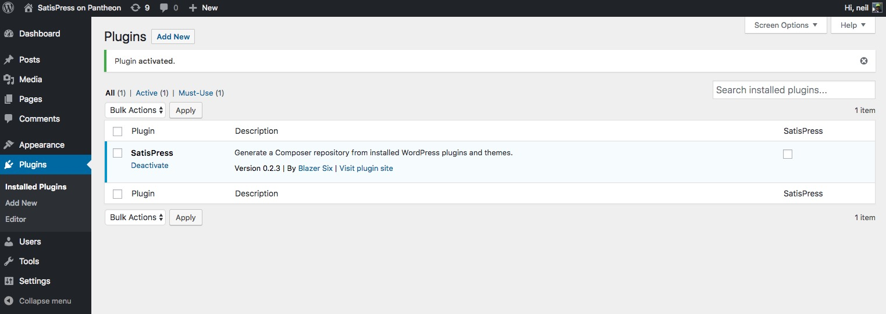
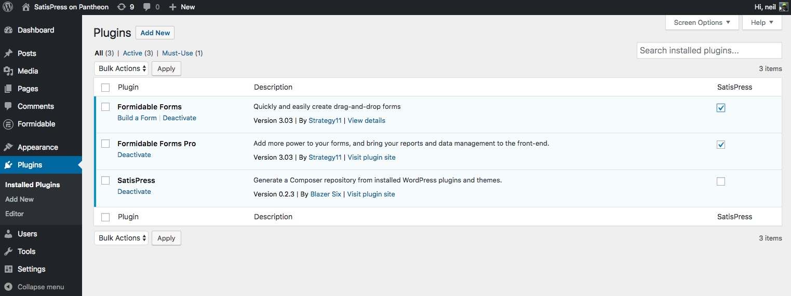
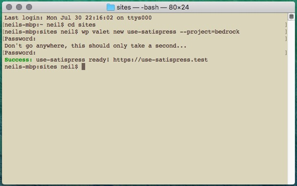
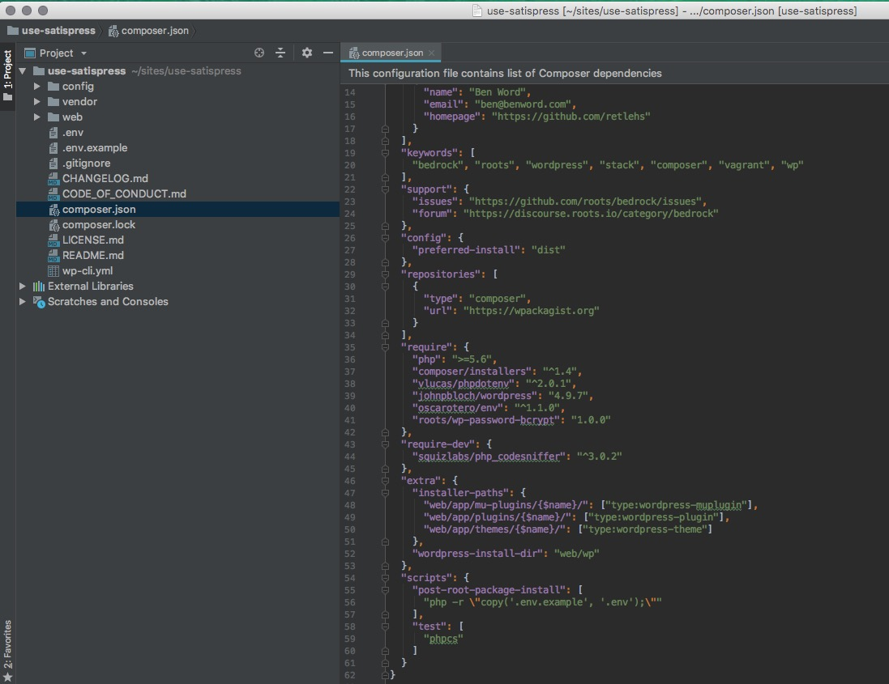
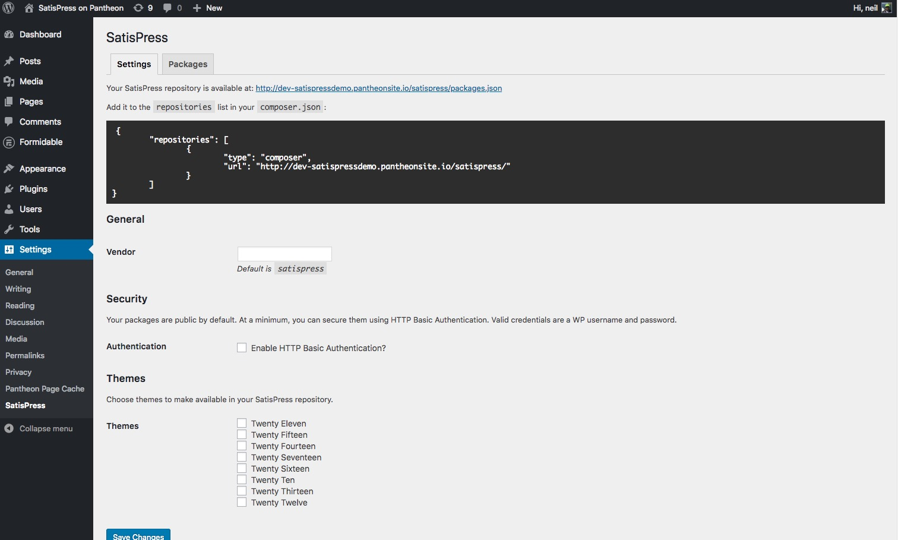
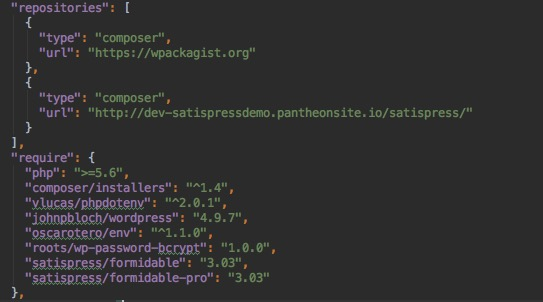
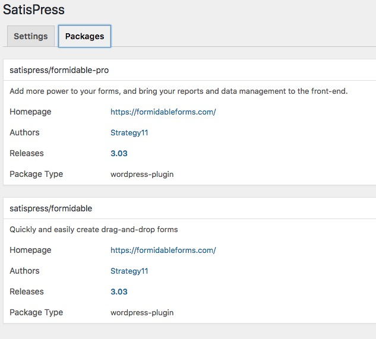
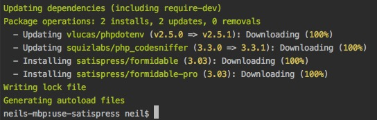
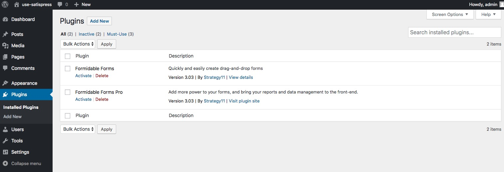

# Why SatisPress?
When you start to look in to adding premium plugins to your `composer.json` file, you'll do some searching (you will search first - won't you!) and you'll find a few different options.

One of those options is [SatisPress](https://github.com/blazersix/satispress). Read their [README.md](https://github.com/blazersix/satispress/blob/master/README.md) for a great primer on what composer is/does, and the problems with premium plugins not having public repos.

Some plugin authors are starting to offer composer access to their plugins. For example [Delicious Brains](https://deliciousbrains.com/composer-premium-wordpress-plugins/), ACF Pro ([kinda](https://discourse.roots.io/t/acf-pro-as-a-composer-dependency-without-committing-your-license-key-unencrypted/6690)), [metabox.io](https://docs.metabox.io/extensions/composer/) and probably some others. Remember that any plugin in the main WordPress repo is available via wpackagist.org and called with the vendor prefix `wpackagist-plugin/` - so for example if you wanted to include Pods in your composer site you can just use `"wpackagist-plugin/pods": "2.7.8"`.

## How?
SatisPress is a standard WordPress plugin, so we need a site to install it on. We'll also install all the premium/private plugins on this same site. SatisPress then makes them available to composer on our other sites.
We also will have the site(s) on which we want to have composer handle our premium plugins. [Bedrock](https://roots.io/bedrock/) is a great way of setting up a WordPress site with controller managing dependencies

### 1. Set up the donor site
Any old WP install will do - I span up a dev site on Pantheon for the purposes of this demo, but a $5 droplet on Digital Ocean with their one click WP-on-16.04 app would also do. It only gives you http initially - https would be better. This is easy enough on Digital Ocean following their comprehensive guides to add a domain name and Let's Encrypt certificate.
Better still, you could use something like Runcloud.io to configure your $5 droplet and install WP for you. It takes a bit longer to install than using Digital Ocean's one-click app, but would be easier to manage after the initial set up.
For my actual SatisPress site I use one of the spare installs on my [Kinsta](https://kinsta.com/plans/) plan. This works really well and only took seconds to spin up a new site.

### 2. Install SatisPress
Read the [installation guide](https://github.com/blazersix/satispress/blob/develop/docs/installation.md) or go ahead and download a zip of the [lastest release](https://github.com/blazersix/satispress/releases/latest).



### 3. Install Premium Plugins
Next install any and all plugins that you want to use with composer. You'll see a checkbox for each plugin on the right of the plugins screen. Make sure to check the boxes for the plugins you want SatisPress to handle.



Activate and add in any licenses needed to get automatic updates.

### 4. Set up your new site
If you're reading this guide then you're probably into setting your WordPress site up properly. For me this means at the very least using [Bedrock](https://roots.io/bedrock/) from Roots so that the whole thing is version controlled - even WordPress core becomes a dependency managed by composer. Neat eh?
I'm setting this site up in my local environment first, (and making regular commits to git)
I use either [Valet+](https://github.com/weprovide/valet-plus) or [Trellis](https://roots.io/trellis) and for quick set up in Valet you can't beat [@aaemnnosttv](https://github.com/aaemnnosttv)'s [WP Cli Valet Command](https://github.com/aaemnnosttv/wp-cli-valet-command).
Here's the whole thing to create a new Bedrock site:
```
$ cd ~/sites
$ wp valet new use-satispress --project=bedrock
```



It's so freakin' awesome!! If you're using Valet+ rather than the standard Valet, we can now open up the project in our editor/IDE of choice with a simple
```
$ valet phpstorm
```
WP Valet Command creates a new directory called `use-satispress`, installs WordPress and sets up the DB, `wp-config.php` and `.env` files. If you browse to https://use-satispress.test you'll see the usual TwentySeventeen homepage. You can log in with username `admin` and password `admin`.

### 5. composer.json
You'll see a `composer.json` file and a `composer.lock` file. The default `composer.json` file that comes with Bedrock looks like this:



Notice on line 29 `"repositories": {` and on line 35 `"require": {`. These are the openings for where we're going to add our satispress repository and then require our premium plugins. There are some things already in there - the main composer repo (packagist) and in `"require":` there's some useful stuff like, ya know, PHP and WordPress.
The WordPress one is interesting - the vendor is `johnpbloch`. You might think it would be `"wordpress/wordpress"` or something, but I guess it's difficult to accept that WordPress core is just one of the dependencies of a project, so there's no `composer.json` file in WordPress. Luckily for us `johnpbloch` maintains a mirror with composer support.

So let's head back to our 'donor' site and grab the repo details. Login and head to `wp-admin > settings > satispress`.



It gives you the code to add in to a composer.jason file;
```
{
    "repositories": [
        {
            "type": "composer",
            "url": "url-of-your-donor-site/satispress"
        }
    ]
}
```

But we don't need all of it because we already have a `"repositories:"` block. So just grab
```
        {
            "type": "composer",
            "url": "url-of-your-donor-site/satispress"
        }
```
and we're going to paste it in below the `packagist` repo already listed in our `composer.json` file so it looks a bit like this


Note the comma after the closing `}` of the `packagist` block. You'll need to add that in or you'll get an error later.
You can also see we've added our custom plugins as requirements. You can get these details from your satispress settings.


Follow the format of the other things in the `"requirements":` block. You'll need to add a [version constraint](https://getcomposer.org/doc/articles/versions.md) - in this case we can only choose `3.03` as Formidable has only just been installed. As we get updates coming in to the satispress site you'll see more version available.
Next up save the file (you remembered to add commas between your `"require":` items yeah?)

### 6. Use composer to install our premium plugins
We now have a `composer.json` with our satispress repo and package details, and we need to install them. You can do this in PHPStorm via its composer support, but it's just as easy to head to the terminal:
```
$ cd ~/sites/use-satispress
$ composer install
```



Some things to note here:
1. composer only fetches from https by default. If your satispress donor site can't be https then you can add in `"secure-http": false,`
1. In SatisPress 0.2.3, packages are [public by default](https://github.com/blazersix/satispress/tree/master#security) but it looks like the [next version](https://github.com/blazersix/satispress/blob/develop/docs/security.md) will have better security built in.
1. consider setting up a cron job to automate checking for updates in your satispress site.

Once you've run `composer install` head back to your new site and _hey presto!_

